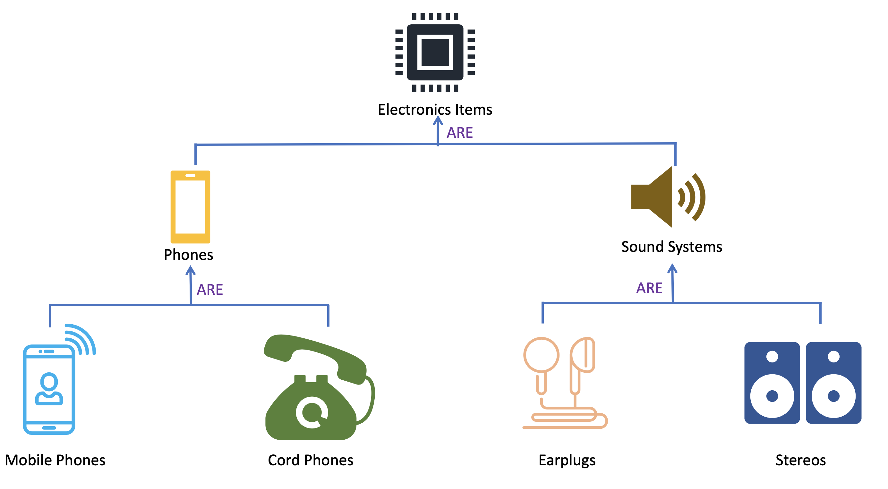
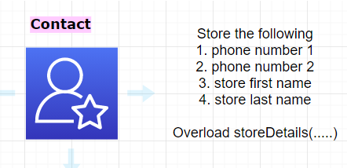

:one: Print "God is Great", compile using javac & run using java.  
:two: Implement inheritance hierarchy mapping to to the diagram below
  
:three: store customer contact details using polymorphism.  
  
